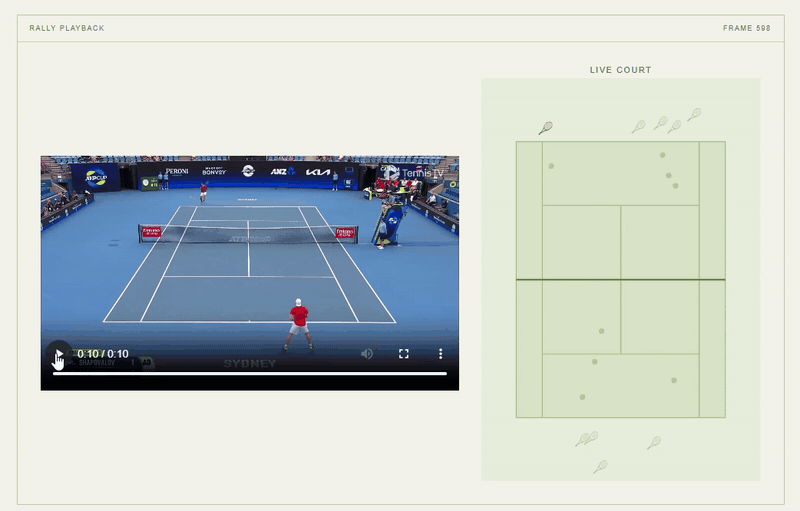
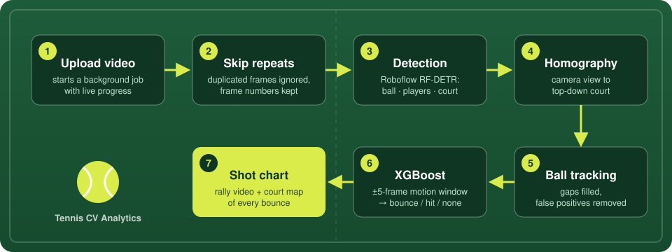

<div align="center">

# 🎾 Tennis Computer Vision Analytics

**Upload a tennis rally. Get every bounce and every hit, mapped onto the court.**

[](https://tennis-computer-vision-analytics.vercel.app/)


</div>

---

## Demo

<p align="center">
  
</p>

<p align="center"><i>Every bounce (ball) and hit (racket) lands on the live court as the rally plays.</i></p>

---

## What it does

Point it at broadcast tennis footage and it will:

| | |
| --- | --- |
| 🟡 **Find the ball** | Detects the ball and players in every frame, then tracks the real ball through misses and false positives. |
| 🏟️ **Understand the court** | Detects court keypoints and computes a homography, so every position can be placed on a top-down court. |
| 💥 **Call bounces and hits** | An XGBoost model looks at the ball's motion around each frame and labels it as a bounce, a hit, or nothing. |
| 📊 **Draw the shot chart** | The web app plays the rally back alongside a court diagram of where each shot landed. |

---

## How it works

<p align="center">
  
</p>

<details>
<summary><b>Step by step</b></summary>

<br/>

1. **Job created.** `POST /analyze` saves the upload to `storage/jobs/<job_id>/input/` and starts processing as a background task. The frontend gets the `job_id` back immediately.
2. **Repeat frames skipped.** Some clips are converted to a higher frame rate by duplicating frames. Each frame is shrunk to 480×270 grayscale and compared with the last real frame; near-identical frames are marked `"Repeat Frame"` and skipped everywhere downstream, while frame numbers still match the original video.
3. **Detection.** Real frames are sent to Roboflow workflows in parallel, with retries and backoff. Frame 1 and every 50th frame also return court keypoints. Progress is written to `status.json` as frames finish.
4. **Homography.** Court keypoints are fit to a top-down court template with RANSAC, so the ball and players can be projected onto the court.
5. **Ball tracking.** `BallTracker` picks the most plausible ball each frame, estimates its position through missed detections, and goes back to fix runs of false positives. Velocity, speed and change of direction are computed for every frame.
6. **Classification.** Each frame gets a window of features from the 5 real frames on either side (speed, velocity, angle, court position, distance to the nearest player, and whether the position was estimated). XGBoost turns that into bounce and hit probabilities, and the peaks above each threshold become events.
7. **Results.** `results.json` stores a label for every frame (`0` none, `1` bounce, `2` hit) with the ball's court position, plus the fps and video name.
8. **Shot chart.** The frontend polls `/jobs/<job_id>/status` until the job finishes, then loads the results and draws the chart.

</details>

---

## Quick start

### 1. Clone

```bash
git clone https://github.com/NoahSantos2006/Tennis-Computer-Vision-Analytics.git
cd Tennis-Computer-Vision-Analytics
```

### 2. Backend

```bash
python -m venv .venv
source .venv/bin/activate          # Windows: .venv\Scripts\activate
pip install -r requirements.txt
```

Add a `.env` file in the repo root (see [Configuration](#configuration)), then start the API **from the repo root**:

```bash
uvicorn backend.main:app --reload  # http://localhost:8000
```

### 3. Frontend

```bash
cd frontend
echo "VITE_API_URL=http://localhost:8000" > .env
npm install
npm run dev                        # http://localhost:5173
```

---

## Configuration

The backend reads every variable below when it starts, so a missing one stops it from importing. Never commit `.env`; it is already git-ignored.

<details>
<summary><b>Backend <code>.env</code> variables</b></summary>

<br/>

| Variable | What it controls |
| --- | --- |
| **Roboflow** | |
| `ROBOFLOW_API_KEY` | API key for hosted inference |
| `WORKSPACE_NAME` | Workspace that holds the workflows |
| `WORKFLOW_ID` | Ball and player detection workflow |
| `WORKFLOW_ID_WITH_COURT_POINTS` | Same, plus court keypoints (frame 1 and every 50th frame) |
| `MAX_WORKERS` | Parallel inference requests |
| `MAX_ATTEMPTS` | Retries per frame before it is marked as failed |
| **Model** | |
| `XGB_BOUNCE_THRESHOLD` | Minimum bounce probability to count as an event |
| `XGB_HIT_THRESHOLD` | Minimum hit probability to count as an event |
| **Court** | |
| `TENNIS_COURT_LENGTH` | Court length in meters |
| `TENNIS_COURT_WIDTH` | Court width in meters |
| `TENNIS_COURT_SCALE` | Pixels per meter on the top-down template |
| `TENNIS_COURT_PADDING` | Padding in pixels around the top-down court |
| **Job cleanup** | |
| `MAX_AGE` | Seconds a finished job is kept |
| `CHECK_EVERY` | Seconds between cleanup runs |

</details>

The frontend needs one variable, `VITE_API_URL`, which points at the backend.

---

## API

| Method | Endpoint | Returns |
| --- | --- | --- |
| `GET` | `/` | Health check |
| `POST` | `/analyze` | Upload a video (`multipart/form-data`, field `video`). Returns the `job id`. |
| `GET` | `/jobs/{job_id}/status` | `status`, `stage`, `current frame`, `total frames`, `progress` |
| `GET` | `/jobs/{job_id}/results` | Per-frame labels with court positions, `fps`, video name |
| `GET` | `/video/{job_id}/{filename}` | The uploaded video, for playback |

<details>
<summary><b>Shape of <code>results.json</code></b> (values are illustrative)</summary>

```json
{
  "ok": true,
  "Bounce Detection Dictionary": {
    "13": { "label": 1, "homography location": [412.6, 731.2] },
    "14": { "label": 0, "homography location": [415.1, 702.8] }
  },
  "fps": 30,
  "video filename": "rally",
  "job id": "3f2c…"
}
```

</details>

---

## Project structure

```text
.
├── backend/
│   ├── main.py               FastAPI app, routes, job sweeper startup
│   ├── predict.py            Pipeline: repeat frames, Roboflow, tracking, classification
│   ├── models/model.ubj      Trained XGBoost bounce/hit model
│   └── scripts/
│       ├── ball_tracker.py   BallTracker and homography fit
│       ├── side_functions.py Tracking driver, angles, bounce/hit picking
│       ├── prepping_model.py Feature windows for the model
│       ├── status.py         Thread-safe job status file
│       └── sweep.py          Deletes old finished jobs
├── frontend/src/
│   ├── VideoUpload.jsx       Upload page and status polling
│   ├── ProcessingVideo.jsx   Progress bar
│   ├── ShotChart.jsx         Results page: video, stats, chart
│   └── TennisCourt.jsx       Top-down court drawing
├── storage/jobs/<job_id>/    Created at runtime, one folder per upload
└── requirements.txt
```

Each job folder holds the upload in `input/`, the intermediate files (`predictions/`, `court_points/`, `BallTracking/`, `status.json`) in `output/`, and the final `results.json`. A background sweeper deletes jobs whose results are older than `MAX_AGE`.

---

## Deployment notes

- The frontend is deployed on Vercel from `frontend/`; each pull request gets a preview build.
- CORS in `backend/main.py` allows `http://localhost:5173` and the Vercel domain. Add any other frontend origin there.

---

## License

Copyright © 2026 Noah Santos. All rights reserved. This code is proprietary; see [LICENSE](LICENSE). No part of it may be copied, modified, or distributed without written permission.